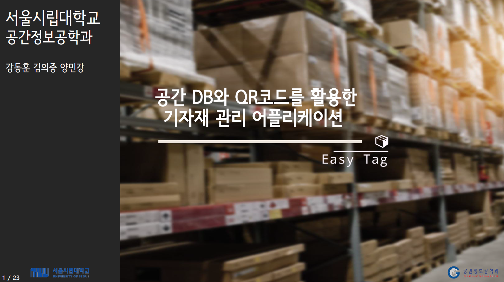

# About EasyTag's API

EasyTag은 qr태그 스캔을 활용한 기자재 관리 어플리케이션입니다. EasyTag 앱에서 API는 기자재 데이터베이스에 쉽게 접근하여 추가, 수정, 삭제 등의 작업을 간편하게 수행할 수 있도록 DB와의 연동작업을 수행합니다. 본 Repository는 EasyTag 앱에서 사용한 API 파일 및 코드를 포함하고 있습니다.

EasyTag에 대한 자세한 설명은 하단 링크를 참조하시기 바랍니다.

[EasyTag 포트폴리오 링크 이동](https://uos-urbanscience.org/archives/uos_portfolio/easy-tag-%ea%b3%b5%ea%b0%84%eb%8d%b0%ec%9d%b4%ed%84%b0%eb%b2%a0%ec%9d%b4%ec%8a%a4%ec%99%80-qr%ec%bd%94%eb%93%9c%eb%a5%bc-%ed%99%9c%ec%9a%a9%ed%95%9c-%ea%b8%b0%ec%9e%90%ec%9e%ac-%ea%b4%80%eb%a6%ac)

[EeayTag 유튜브 소개 영상](https://youtu.be/ndC635tRycI)

