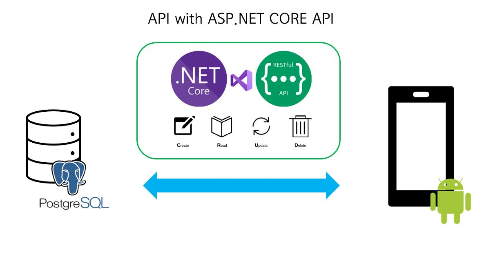

## What is EasyTag?

EasyTag는 qr태그 스캔과 공간데이터베이스를 활용한 기자재 관리 어플리케이션으로, 기자재 관리시 기존의 RFID 리더기 태그 방식에서 벗어나 스마트폰의 어플리케이션을 통해 손쉽게 기자재에 대한 다양한 관리 기능과 추가적인 작업 기능을 실행할 수 있습니다. 특히, EasyTag는 PostGIS를 통해 구현된 공간데이터베이스 기능과 Mapbox Android SDK를 통한 모바일 지도 기능을 통해 기자재의 공간적인 관리 기능을 지원합니다.

## About API

ASP.NET CORE API로 구현된 본 API 프로그램은 서버 DB와 안드로이드 모바일 어플리케이션간의 상호 연동을 위해 개발된 프로그램으로, CRUD를 비롯한 다양한 연동 기능을 지원합니다.

## More Information

EasyTag에 대한 보다 자세한 설명은 하단 링크들을 참조하시기 바랍니다.

### EasyTag 소개 영상

### 추가 링크

[EasyTag 전시 링크](https://uos-urbanscience.org/archives/uos_portfolio/easy-tag-%ea%b3%b5%ea%b0%84%eb%8d%b0%ec%9d%b4%ed%84%b0%eb%b2%a0%ec%9d%b4%ec%8a%a4%ec%99%80-qr%ec%bd%94%eb%93%9c%eb%a5%bc-%ed%99%9c%ec%9a%a9%ed%95%9c-%ea%b8%b0%ec%9e%90%ec%9e%ac-%ea%b4%80%eb%a6%ac)

[EasyTag - API 설명 보기](https://aka2344.github.io/graduproj1)

